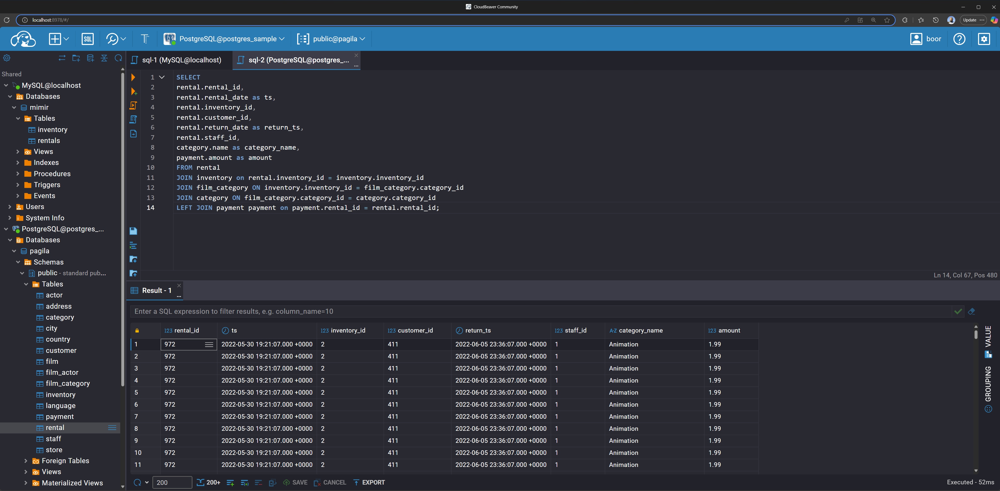

# Mimir

[](https://github.com/liaco/mimir/actions/workflows/ci.yaml)
[](https://opensource.org/licenses/MIT)


A friendly, lightweight semantic layer for data analytics, inspired by Airbnb's Minerva.

> **Disclaimer**
>
> Mimir is a project born out of curiosity to explore the core ideas behind a metrics store. It's a playground for demonstrating architectural patterns and seeing what a "metrics-as-code" workflow can feel like.
>
> So while it's built with solid engineering principles in mind, it is **not (and probably will never be) meant for production use**. Feel free to clone it, break it, learn from it, and have fun!

## The "Why":

You can find more about the context and the purpose of this project in this [Medium article](https://medium.com/@lorenzo_iacolare/inspired-by-airbnbs-minerva-building-a-lightweight-metrics-store-in-python-d27714adb6f5).

## Architecture Overview


Mimir is designed to separate the development and consumption of metrics. The CLI is the primary tool for the "Control Plane" (managing definitions), while the server components form the "Service Plane" (serving data to clients).

This separation allows analytics engineers to define and validate metrics in a version-controlled, git-native workflow, while data consumers (whether BI tools or ad-hoc users) can query a stable, unified API.

```
+-----------------------+      +----------------+      +-------------------+      +---------------------+
|   Analytics Engineer  |----->|   Mimir CLI    |----->|   Git Repository  |----->|   CI/CD Pipeline    |
| (on their laptop)     |      | (create,       |      | (Metrics as Code) |      | (mimir validate)    |
+-----------------------+      |  validate,     |      +-------------------+      +----------+----------+
                               |  query --dry-run) |                                          |
                               +----------------+                                          | (Sync)
                                                                                           |
                                                                                           v
+-----------------------+      +----------------+      +-------------------+      +---------------------+
|   BI Tool (Tableau)   |----->| SQL Proxy      |----->|   Mimir Server    |<-----|  Config DB / S3     |
+-----------------------+      +----------------+      | (FastAPI)         |      | (Centralized Store) |
                               (MySQL Protocol)        +---------^---------+      +---------------------+
                                                                 |
+-----------------------+                                        | (HTTP API)
| Ad-hoc User           |----->|  Mimir Client  |-----------------+
| (on their laptop)     |      | (Python/Jupyter)|
+-----------------------+      +----------------+
```

### Core Components

*   **API Server:** A FastAPI server that accepts `Inquiry` requests and returns data in Apache Arrow format.
*   **SQL Proxy:** A MySQL-compatible proxy (using `mysql-mimic`) that lets you query Mimir with the SQL you already know and love. It translates your queries into Mimir API requests behind the scenes.
*   **Query Engine:** The brains of the operation. It uses a **split-apply-combine** strategy: it splits an inquiry into atomic queries for each data source, executes them in parallel, and uses an in-memory DuckDB instance to perform the final join.

## Quickstart with the Example

### 1. Prerequisites

1. Get a fresh new WSL machine up:

   ```powershell
   # Delete old WSL
   wsl --unregister Ubuntu-24.04

   # Create new WSL
   wsl --install -d Ubuntu-24.04
   ```

1. Clone the repo, and open VSCode in it:

   ```bash
   cd ~/

   git config --global user.name "Raki Rahman"
   git config --global user.email "mdrakiburrahman@gmail.com"
   git clone https://github.com/mdrakiburrahman/data-playground.git

   cd data-playground/
   code .
   ```

1. Reset your docker WSL integration since this is a new VM:

   > `Docker Desktop: Settings > Resources > WSL Integration > Turn off/on Ubuntu-24.04`

1. Run the bootstrapper script, that installs all tools idempotently:

   ```bash
   GIT_ROOT=$(git rev-parse --show-toplevel)
   chmod +x ${GIT_ROOT}/contrib/bootstrap-dev-env.sh && ${GIT_ROOT}/contrib/bootstrap-dev-env.sh && source ~/.bashrc
   ```

### 2. Install Dependencies

This project uses `uv` for fast dependency management. The `install-dev` command will create a virtual environment, install all necessary packages, and set up pre-commit hooks.

```bash
make install-dev
```

### 3. Start the Services

Build and start the Docker containers for the Mimir API, the SQL proxy, and a sample PostgreSQL database.

```bash
make example-up
```

To setup intellisense, open any Python file, then:


### 4. Query Your Data

Once the services are running, you can query Mimir in two ways:

#### Through the SQL Proxy

Connect to the proxy using any MySQL-compatible client (e.g., `mysql`, DBeaver, DataGrip).

*   **Host:** `localhost` (in CloudBeaver, use `mimir_proxy`)
*   **Port:** `3306`
*   **User/Password:** (leave as blank strings, there's no auth)

The docker compose includes CloudBeaver, accessible at `http://localhost:8978`.

```sql
-- This query will be translated into an API call
SELECT
  dim_rental_category,
  AGG(movies_rented),
  AGG(rentals_revenue)
FROM
  mimir.metrics
WHERE
  dim_rental_category = 'Action'
GROUP BY
  dim_rental_category;
```
> **Note:** The SQL Proxy is experimental and does not yet support CTEs, subqueries, or derived tables.


Notice how the actual data is coming out of Postgres, and the tables look like this:

```sql
SELECT * FROM rental;
```


And our `rentals` source, defined in `sources.yaml`, looks like this:

```sql
SELECT 
rental.rental_id,
rental.rental_date as ts,
rental.inventory_id,
rental.customer_id,
rental.return_date as return_ts,
rental.staff_id,
category.name as category_name,
payment.amount as amount
FROM rental
JOIN inventory on rental.inventory_id = inventory.inventory_id
JOIN film_category ON inventory.inventory_id = film_category.category_id
JOIN category ON film_category.category_id = category.category_id
LEFT JOIN payment payment on payment.rental_id = rental.rental_id;
```



#### Through the API

You can also talk to the API directly. The interactive docs are available at `http://localhost:8090/docs`.

### 5. Stop the Services

When you're done exploring:
```bash
make example-down
```

## Configuration Reference

Mimir is driven by YAML configuration files located in the `configs` directory.

### Sources (`configs/sources/`)

Sources define the "denormalized layer" and point to your underlying data. They are defined as a dictionary in one or more YAML files.

| Key               | Type   | Required | Description                                                              |
| ----------------- | ------ | -------- | ------------------------------------------------------------------------ |
| `name`            | string | Yes      | The unique name for the source.                                          |
| `time_col`        | string | Yes      | The name of the primary timestamp/date column in the underlying table.   |
| `connection_name` | string | Yes      | The name of the secret file (w/o .json) in the `secrets` directory.      |
| `sql`             | string | Yes      | A SQL query that defines the source, including joins and transformations.|
| `dimensions`      | list   | No       | A list of dimension names that can be joined to this source.             |
| `time_col_alias`  | string | No       | An optional alias for the `time_col`.                                    |
| `description`     | string | No       | A human-readable description of the source.                              |

### Metrics (`configs/metrics/`)

Metrics define the quantitative calculations for your business.

| Key               | Type   | Required | Description                                                              |
| ----------------- | ------ | -------- | ------------------------------------------------------------------------ |
| `name`            | string | Yes      | The unique name for the metric.                                          |
| `source_name`     | string | Yes      | The name of the source this metric is built on.                          |
| `sql`             | string | Yes      | The SQL aggregation expression (e.g., `SUM(amount) as revenue`).         |
| `description`     | string | No       | A human-readable description of the metric.                              |
| `required_dimensions` | list | No   | A list of dimensions that must be available when querying this metric.   |

### Dimensions (`configs/dimensions/`)

Dimensions define the categorical fields you can group by.

| Key           | Type   | Required | Description                                                              |
| ------------- | ------ | -------- | ------------------------------------------------------------------------ |
| `name`        | string | Yes      | The unique name for the dimension.                                       |
| `source_name` | string | Yes      | The name of the source this dimension applies to.                        |
| `sql`         | string | Yes      | The SQL expression for the dimension column (e.g., `COALESCE(c.name, 'N/A')`). |
| `description` | string | No       | A human-readable description of the dimension.                           |

## Command-Line Interface (CLI)

Mimir includes a powerful CLI for developing, validating, and querying your semantic layer. You can invoke it using `uv run mimir -- [COMMAND]`.

### Project Scaffolding

**`init`**

Initializes a new Mimir project with the standard directory structure.

```bash
mkdir my-mimir-project
cd my-mimir-project
uv run mimir init
```

**`create`**

Interactively create new metric or dimension definitions.

```bash
# Create a new metric
uv run mimir create metric

# Create a new dimension
uv run mimir create dimension
```

### Introspection and Validation

**`validate`**

Validates all configuration files in a specified directory to ensure they are syntactically correct and semantically valid.

```bash
uv run mimir validate --configs path/to/your/configs
```

**`list`**

Lists all available definitions of a certain type.

```bash
# List all available data sources
uv run mimir list sources

# List all available metrics
uv run mimir list metrics

# List all available dimensions
uv run mimir list dimensions
```

**`describe`**

Shows detailed metadata for a single definition, including its description and underlying SQL.

```bash
uv run mimir describe <definition_name> <metric|dimension|source>
```

### Querying

**`query`**

Runs a query against the Mimir engine. This command can be run in two modes:

1.  **Local Mode:** Runs the query engine directly on your machine, using local config and secret files.
2.  **Remote Mode:** Acts as a client to a running Mimir API server.

Here's how you would run the same query from the SQL example using the CLI against a running Mimir server:

```bash
uv run mimir query \
  --host http://localhost:8090 \
  --metric movies_rented \
  --metric rentals_revenue \
  --dimension dim_rental_category \
  --filter "dim_rental_category = 'Action'"
```

You can also run it locally (without the `--host` flag) or use `--dry-run` to see the compiled SQL without executing it.

## Extensibility

Mimir is built to be extended. If you don't like how something works, you can change it. Here are a couple of ideas to get you started.

### Custom Connections

Want to connect to a data source that isn't supported out-of-the-box?

1.  **Create a new class** that inherits from `mimir.api.connections.Connection`.
2.  **Implement the `query` method.** This method just needs to accept a SQL string and return the results as a `pyarrow.Table`.

Once you've done that, just register your new connection in the `ConnectionFactory` and Mimir will know how to use it.

### Custom Configuration Loaders

Tired of YAML files? Want to load your metric definitions from a database, a Git repo, or an S3 bucket? Go for it.

1.  **Create a new class** that inherits from `mimir.api.loaders.BaseConfigLoader`.
2.  **Implement the required methods** (`get`, `get_all`, `get_secret`).

Pass an instance of your new loader to the `MimirEngine`, and you're off to the races.

## Contributing & Roadmap

This project is a learning experiment, but contributions are absolutely welcome! Please feel free to open an issue or submit a pull request.

### Roadmap

Here are some ideas for improvements. Help is wanted!

*   **Better config validation:** Improve handling of malformed configurations and the CLI validate tool
*   **More Data Sources:** Add native connection support for BigQuery, Snowflake, etc.
*   **Enhanced SQL Proxy:** Add support for more complex queries and easier virtual tables discoverability.
*   **Web UI:** A simple web interface for exploring and managing definitions.